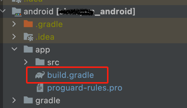

### release模式下运行报错：
```
[ERROR:flutter/runtime/dart_vm_initializer.cc(41)] Unhandled Exception: PlatformException(error, Field state_ for o.r not found. Known fields are [private int o.r.h, private static final o.r o.r.i, private static volatile q.a1 o.r.j], null, java.lang.RuntimeException: Field state_ for o.r not found. Known fields are [private int o.r.h, private static final o.r o.r.i, private static volatile q.a1 o.r.j]
E/flutter (23106):      at q.v0.n0(Unknown Source:72)
E/flutter (23106):      at q.v0.T(Unknown Source:655)
E/flutter (23106):      at q.v0.R(Unknown Source:12)
E/flutter (23106):      at q.k0.e(Unknown Source:60)
E/flutter (23106):      at q.k0.a(Unknown Source:49)
E/flutter (23106):      at q.d1.d(Unknown Source:17)
E/flutter (23106):      at q.d1.e(Unknown Source:4)
E/flutter (23106):      at q.z.A(Unknown Source:4)
E/flutter (23106):      at q.z$a.q(Unknown Source:9)
E/flutter (23106):      at q.z$a.p(Unknown Source:0)
E/flutter (23106):      at o.i.onMethodCall(Unknown Source:800)
E/flutter (23106):      at io.flutter.plugin.common.MethodChannel$IncomingMethodCallHandler.onMessage(Unknown Source:17)
E/flutter (23106):      at io.flutter.embedding.engine.dart.DartMessenger.invokeHandler(Unknown Source:18)
E/flutter (23106):      at io.flutter.embedding.engine.dart.DartMessenger.lambda$dispatchMessageToQueue$0(Unknown Source:40)
E/flutter (23106):      at io.flutter.embedding.engine.dart.DartMessenger.a(Unknown Source:0)
E/flutter (23106):      at io.flutter.embedding.engine.dart.a.run(Unknown Source:12)
E/flutter (23106):      at android.os.Handler.handleCallback(Handler.java:966)
E/flutter (23106):      at android.os.Handler.dispatchMessage(Handler.java:110)
E/flutter (23106):      at android.os.Looper.loopOnce(Looper.java:205)
E/flutter (23106):      at android.os.Looper.loop(Looper.java:293)
E/flutter (23106):      at android.app.ActivityThread.main(ActivityThread.java:9596)
E/flutter (23106):      at java.lang.reflect.Method.invoke(Native Method)
E/flutter (23106):      at com.android.internal.os.RuntimeInit$MethodAndArgsCaller.run(RuntimeInit.java:586)
E/flutter (23106):      at com.android.internal.os.ZygoteInit.main(ZygoteInit.java:1204)
E/flutter (23106): )
E/flutter (23106): #0      StandardMethodCodec.decodeEnvelope (package:flutter/src/services/message_codecs.dart:653)
E/flutter (23106): #1      MethodChannel._invokeMethod (package:flutter/src/services/platform_channel.dart:315)
E/flutter (23106): <asynchronous suspension>
E/flutter (23106): #2      FlutterBluePlus.state (package:flutter_blue_plus/src/flutter_blue_plus.dart:91)
E/flutter (23106): <asynchronous suspension>
E/flutter (23106): #3      Stream.last.<anonymous closure> (dart:async/stream.dart:1605)
E/flutter (23106): <asynchronous suspension>
E/flutter (23106): 

```

**解决方法有两种：**

1. 修改项目下android目录下 build.gradler
(]

修改配置如下：
```
buildTypes {
        release {
            // TODO: Add your own signing config for the release build.
            // Signing with the debug keys for now, so `flutter run --release` works.
            signingConfig signingConfigs.release
           // minifyEnabled true
            shrinkResources false
            minifyEnabled false
           // useProguard true

           // proguardFiles getDefaultProguardFile('proguard-android.txt'), 'proguard-rules.pro'
        }
    }
```

***此修改不是特别好***

2. 通过修改**proguard-rules.pro***文件,此文件也是项目下android目录下，修改配置如下：
```
#Flutter Wrapper
-keep class io.flutter.app.** { *; }
-keep class io.flutter.plugin.**  { *; }
-keep class io.flutter.util.**  { *; }
-keep class io.flutter.view.**  { *; }
-keep class io.flutter.**  { *; }
-keep class io.flutter.plugins.**  { *; }
-keep class com.boskokg.flutter_blue_plus.** { *; }
```

最后一行就是解决这次的错误，根据使用的组件报错信息，添加配置信息

  
