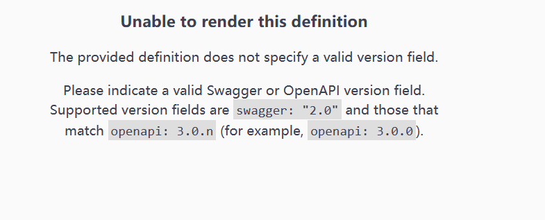

# 升级后发现报错 Unable to render this definition
 
  

查看控制台发现返回的内容是byte数组，经过查看github issues需要添加针对byte转换器

## 解决方法如下

在 **ConfigurerAdapter** 类文件的 ***configureMessageConverters*** 方法里加入
```
 @Override
    public void configureMessageConverters(List<HttpMessageConverter<?>> converters) {
        // 使用 fastjson 序列化，会导致 @JsonIgnore 失效，可以使用 @JSONField(serialize = false) 替换
        FastJsonHttpMessageConverter converter = new FastJsonHttpMessageConverter();
        List<MediaType> supportMediaTypeList = new ArrayList<>();
        supportMediaTypeList.add(MediaType.APPLICATION_JSON);
        supportMediaTypeList.add(MediaType.TEXT_PLAIN);
        FastJsonConfig config = new FastJsonConfig();
        config.setWriterFeatures(JSONWriter.Feature.WriteEnumsUsingName, JSONWriter.Feature.NotWriteRootClassName);
        config.setDateFormat("yyyy-MM-dd HH:mm:ss");
        converter.setFastJsonConfig(config);
        converter.setSupportedMediaTypes(supportMediaTypeList);
        converter.setDefaultCharset(StandardCharsets.UTF_8);


        converters.add(new ByteArrayHttpMessageConverter());//主要添加这一行


        converters.add(converter);
    }

```
